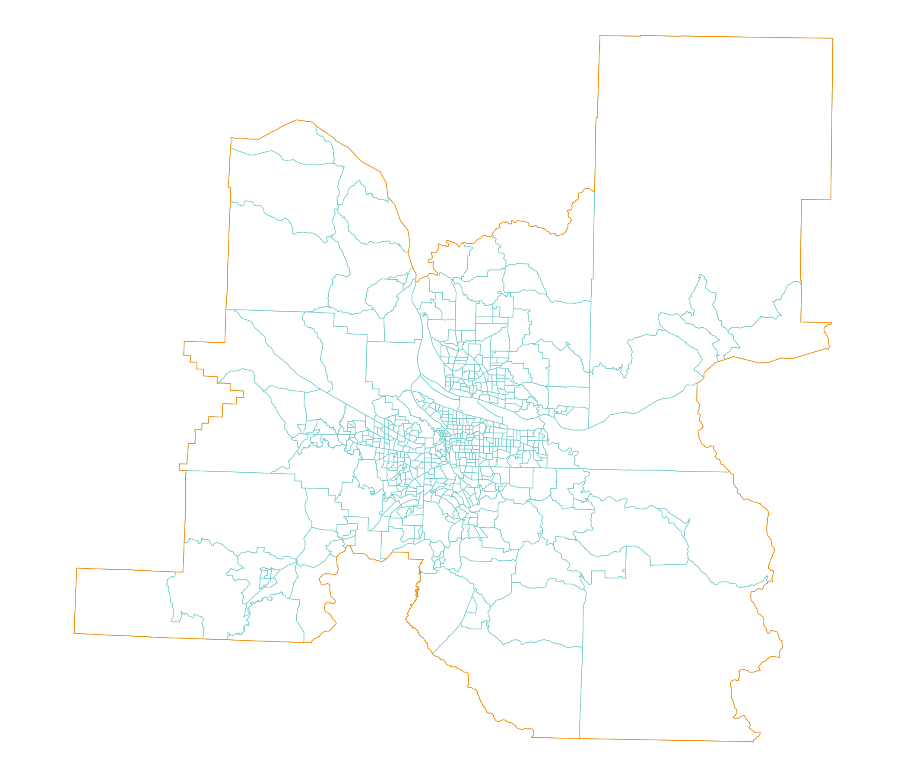

In this section you can see the culmination of all that I have learned in this class. I perform a case study on demographic change in my hometown, Portland, OR. Specifically I look at the entire CBSA, which spans two states (Oregon and Washington) and has a population of approximately 2.5 million people.

{fig-align="center" width="535"}

There are 568 census tracts in the CBSA.

```{r}
#| echo: false
# Here I will perform a case study of the demographic change portland, OR has experienced over 15 years.
library(tidycensus)
library(tidyverse)
library(readr)
library(ggplot2)
library(scales)
census_api_key("e9fab01c12797a522e0541e2b24496af231563af", overwrite = TRUE, install = TRUE)
readRenviron("~/.Renviron")

#------------------------------------------------------------------------------
# Pop. Pyramid for Portland MSA 2015
# Downloading population sex data for the Portland MSA
portland_counties_2015 <- get_estimates(
  geography = "county",
  state = c("OR", "WA"),
  product = "characteristics",
  breakdown = c("SEX", "AGEGROUP"),
  breakdown_labels = TRUE,
  year = 2015
)

# Filter for the 7 counties that make up the Portland MSA and aggregate them
portland_msa_2015 <- portland_counties_2015 %>%
  filter(
    # Filter by specific GEOIDs of the Portland MSA counties
    GEOID %in% c(
      "41051", "41067", "41005", "41009", "41071", # Multnomah, Washington, Clackamas, Columbia, Yamhill (OR)
      "53011", "53059"                             # Clark, Skamania (WA)
    )
  ) %>%
  # Group by the demographics and sum the values across the counties
  group_by(SEX, AGEGROUP) %>%
  summarize(value = sum(value, na.rm = TRUE), .groups = "drop")

# Filter and mirror the data for the pyramid
portland_2015_filtered <- portland_msa_2015 %>% 
  filter(str_detect(AGEGROUP, "^Age"),
         SEX != "Both sexes") %>%
  mutate(value = ifelse(SEX == "Male", -value, value))

# Plot the pyramid
portland_2015_pyramid <- ggplot(portland_2015_filtered,
                           aes(x = value,
                               y = AGEGROUP,
                               fill = SEX)) +
  geom_col(width = 0.95, alpha = 0.75) +
  theme_minimal(base_family = "Verdana",
                base_size = 12) +
  scale_x_continuous(
    labels = ~ number_format(scale = .001, suffix = "k")(abs(.x)),
    limits = 100000 * c(-1, 1) # Tailored scale limit for the aggregated MSA data
  ) +
  scale_y_discrete(labels = ~ str_remove_all(.x, "Age\\s|\\syears")) +
  scale_fill_manual(values = c("deeppink", "deepskyblue")) +
  labs(x = "",
       y = "2015 Census Bureau population estimate",
       title = "Population structure in the Portland MSA",
       subtitle = "Aggregated from component counties in OR and WA",
       fill = "",
       caption = "Sources: US Census Bureau PEP, tidycensus R package")

portland_2015_pyramid
```

```{r}
#| echo: false
# Here I will perform a case study of the demographic change portland, OR has experienced over 15 years.
library(tidycensus)
library(tidyverse)
library(readr)
library(ggplot2)
library(scales)
census_api_key("e9fab01c12797a522e0541e2b24496af231563af", overwrite = TRUE, install = TRUE)
readRenviron("~/.Renviron")

#------------------------------------------------------------------------------
# Pop. Pyramid for Portland MSA 2019
# Downloading population sex data for the Portland MSA
portland_counties_2019 <- get_estimates(
  geography = "county",
  state = c("OR", "WA"),
  product = "characteristics",
  breakdown = c("SEX", "AGEGROUP"),
  breakdown_labels = TRUE,
  year = 2019
)

# Filter for the 7 counties that make up the Portland MSA and aggregate them
portland_msa_2019 <- portland_counties_2019 %>%
  filter(
    # Filter by specific GEOIDs of the Portland MSA counties
    GEOID %in% c(
      "41051", "41067", "41005", "41009", "41071", # Multnomah, Washington, Clackamas, Columbia, Yamhill (OR)
      "53011", "53059"                             # Clark, Skamania (WA)
    )
  ) %>%
  # Group by the demographics and sum the values across the counties
  group_by(SEX, AGEGROUP) %>%
  summarize(value = sum(value, na.rm = TRUE), .groups = "drop")

# Filter and mirror the data for the pyramid
portland_2019_filtered <- portland_msa_2019 %>% 
  filter(str_detect(AGEGROUP, "^Age"),
         SEX != "Both sexes") %>%
  mutate(value = ifelse(SEX == "Male", -value, value))

# Plot the pyramid
portland_2019_pyramid <- ggplot(portland_2019_filtered,
                           aes(x = value,
                               y = AGEGROUP,
                               fill = SEX)) +
  geom_col(width = 0.95, alpha = 0.75) +
  theme_minimal(base_family = "Verdana",
                base_size = 12) +
  scale_x_continuous(
    labels = ~ number_format(scale = .001, suffix = "k")(abs(.x)),
    limits = 100000 * c(-1, 1) # Tailored scale limit for the aggregated MSA data
  ) +
  scale_y_discrete(labels = ~ str_remove_all(.x, "Age\\s|\\syears")) +
  scale_fill_manual(values = c("deeppink", "deepskyblue")) +
  labs(x = "",
       y = "2019 Census Bureau population estimate",
       title = "Population structure in the Portland MSA",
       subtitle = "Aggregated from component counties in OR and WA",
       fill = "",
       caption = "Sources: US Census Bureau PEP, tidycensus R package")

portland_2019_pyramid
```

```{r}
#| echo: false
# Pop. Pyramid for Portland MSA 2024
library(tidycensus)
library(tidyverse)
library(scales)

# 1. Fetch the data using standard calendar years
portland_2024_sex <- get_estimates(
  geography = "state",
  state = "OR",
  product = "characteristics",
  breakdown = c("SEX", "AGEGROUP"),
  breakdown_labels = TRUE,
  vintage = 2024,
  year = 2024  # Use the standard 4-digit calendar year
)

# 2. Filter and shape the data
portland_2024_filtered <- portland_2024_sex %>% 
  filter(
    str_detect(AGEGROUP, "^Age"), # Captures "Age 0 to 4 years", etc.
    SEX != "Both sexes"
  ) %>%
  mutate(value = ifelse(SEX == "Male", -value, value))

# 3. Plot the population pyramid
portland_2024_pyramid <- ggplot(portland_2024_filtered,
                               aes(x = value,
                                   y = AGEGROUP,
                                   fill = SEX)) +
  geom_col(width = 0.95, alpha = 0.75) +
  theme_minimal(base_family = "Verdana", base_size = 12) +
  scale_x_continuous(
    labels = ~ number_format(scale = .001, suffix = "k")(abs(.x)),
    limits = 160000 * c(-1,1)
  ) +
  scale_y_discrete(labels = ~ str_remove_all(.x, "Age\\s|\\syears")) + 
  scale_fill_manual(values = c("deeppink", "deepskyblue")) +
  labs(x = "",
       y = "Census Bureau population estimate 2024",
       title = "Population structure in Oregon",
       fill = "",
       caption = "Sources: US Census Bureau PEP, tidycensus R package")

# Display the final plot
print(portland_2024_pyramid)
```
