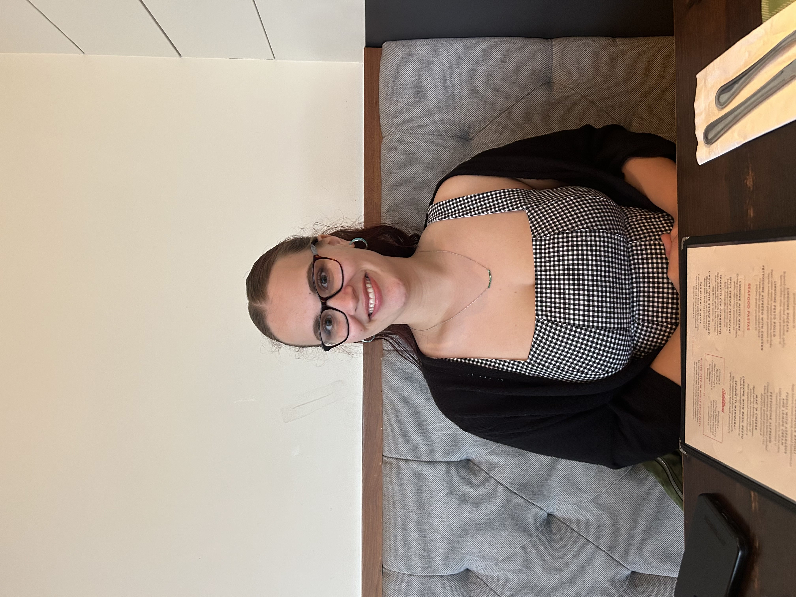
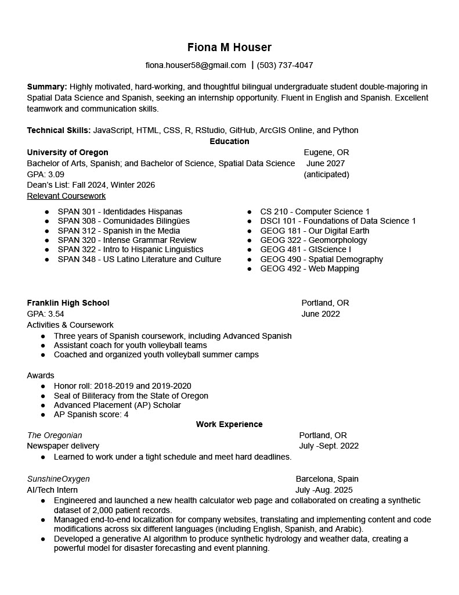

{fig-align="center" width="280"}

Hello! My name is Fiona Houser and this is my personal website/portfolio made for GEOG 490. I am a fourth year student at the University of Oregon, double majoring in Spatial Data Science (SDS) and Spanish. I am originally from Portland.

### Here is my resume/CV

{fig-align="center" width="554"}

To learn more about Quarto websites visit <https://quarto.org/docs/websites>.
